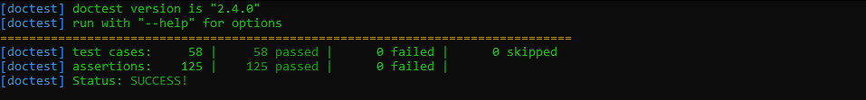

## Defender
Work in Progress but about 95% of the Logic has been Implemented.

The main aim for this project was a clear separation of concerns (Along with other good coding practices like test driven Software Development).
The final end goal (as is currently) is to allow any developer/client to re-use the game logic with any graphics library. The code implementation is completely decoupled from any graphics library.

## Tests
Unit testing made via doctest framework

